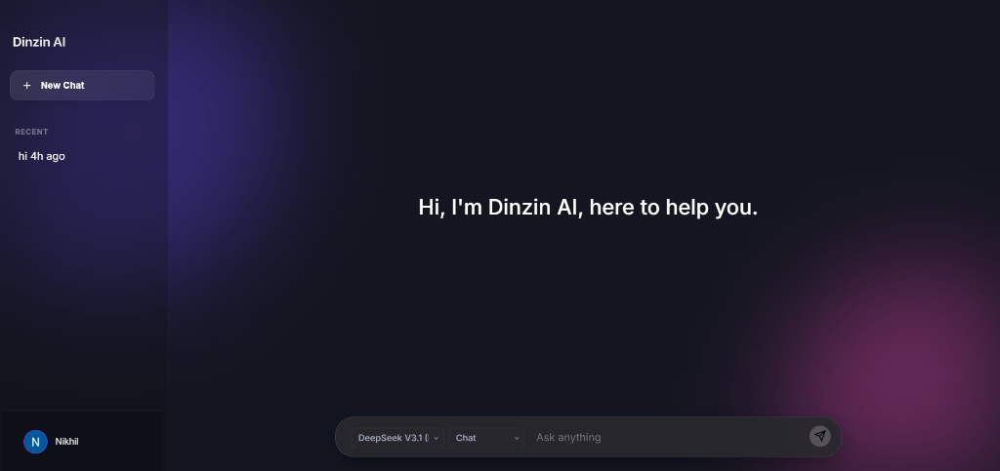

# Dinzin AI 🤖

**Dinzin AI** is a powerful, modern, and responsive AI chat application that aggregates multiple Large Language Models (LLMs) into a single, seamless interface. Built with a lightweight Node.js backend and a glassmorphism-inspired UI, it offers a premium user experience across all devices.


## ✨ Features

- **Multi-Model Support**: Switch instantly between top-tier AI models:
  - 🧠 **DeepSeek V3.1**
  - 💎 **Gemini 1.5 Flash** (Google)
  - 🦙 **Llama 3.3 70B** (Groq)
  - 🤖 **GPT-OSS 20B**
- **Smart Modes**: Choose how you want the AI to respond:
  - 💬 **Chat**: Standard conversation.
  - 📝 **Summarize**: Get concise summaries of long texts.
  - 📧 **Draft Reply**: Generate professional email/text replies.
  - • **Bullet Points**: Break down complex info into lists.
- **Persistent Chat History**: Log in to save your conversations to the cloud (MongoDB) and access them from any device.
- **Google Sign-In**: Secure and fast authentication.
- **Responsive Design**: Fully optimized for mobile and desktop with a custom "Drop-Up" mobile menu for easy navigation.
- **Glassmorphism UI**: A sleek, modern aesthetic with animated backgrounds and smooth transitions.

## 🛠️ Tech Stack

- **Frontend**: HTML5, CSS3 (Vanilla), JavaScript (ES6+)
- **Backend**: Node.js (Primary Server) & PHP (API Endpoint)
- **Database**: MongoDB (Atlas)
- **AI Providers**: Groq, Google Gemini, OpenRouter, DeepSeek

## 📸 Screenshots


*The main chat interface with glassmorphism design.*


## 🚀 Getting Started

Follow these instructions to set up the project locally on your machine.


### Installation

1.  **Clone the repository**
    ```bash
    git clone https://github.com/N-i-k-h/dinzinai.git
    cd dinzinai
    ```

2.  **Install dependencies**
    ```bash
    npm install
    ```

3.  **Configure Environment Variables**
    Create a `.env` file in the root directory and add your keys:
    ```env
    PORT=8000
    MONGO_URI=your_mongodb_connection_string
    DB_NAME=dinzin_ai
    
    # AI Provider Keys
    GROQ_API_KEY=your_groq_key
    GEMINI_API_KEY=your_gemini_key
    DEEPSEEK_API_KEY=your_deepseek_key
    OPENROUTER_API_KEY=your_openrouter_key
    ```

4.  **Run the Server**
    ```bash
    npm start
    ```

5.  **Open in Browser**
    Visit `http://localhost:8000` to start chatting!


## 🤝 Usage

1.  **Select a Model**: Use the dropdown (bottom-left) to choose the AI model that suits your task.
2.  **Choose a Mode**: Select "Chat", "Summarize", etc., to tailor the AI's behavior.
3.  **Chat**: Type your message and hit Enter.
4.  **Login (Optional)**: Click the avatar icon to log in with Google and save your chat history.


## live link
https://dinzinai-1.onrender.com
